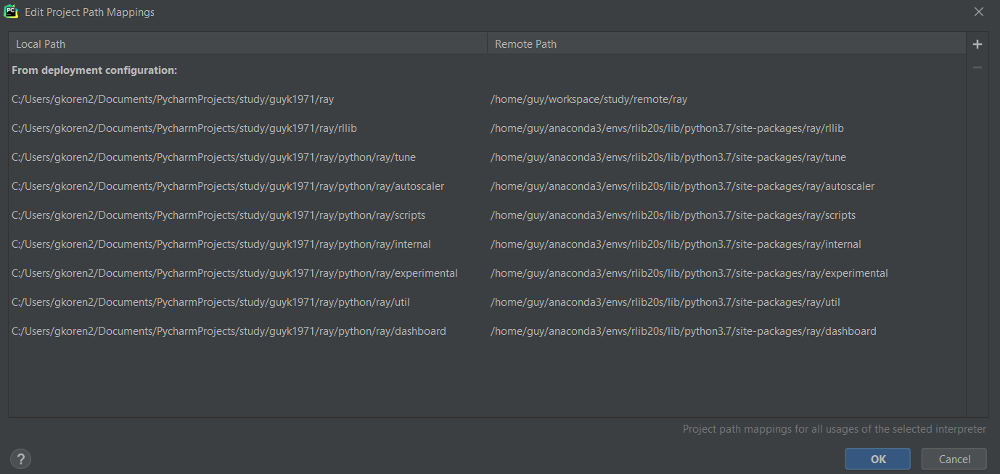

RLlib: Scalable Reinforcement Learning
======================================

RLlib is an open-source library for reinforcement learning that offers both high scalability and a unified API for a variety of applications.

For an overview of RLlib, see the [documentation](http://ray.readthedocs.io/en/latest/rllib.html).

For a shortened version see [intro notebook](../my_scripts/notebooks/rllib_intro.html)


## Development
This section explains how to do remote development. we assume that we're using Pycharm and the code is runing on remote server

### Installation on remote server
- `conda create -n rllib --clone rl20` - clone a virtual environment that includes tensorflow
- Install the ray library  [latest snapshot whl build](https://ray.readthedocs.io/en/latest/installation.html#latest-snapshots-nightlies)
- `pip install tensorboardX`
- `pip install lz4`
- `pip install dm-tree`

**On the laptop**   
- `git clone` the repository
- Open in Pycharm  
- set the interpreter to be rllib env's python
- set the mapping between the project folder and the remote path as follows:  


Notes:
- the list of folders that we map is extracted from the `setup-dev.py` script. instead of generating soft links to our 
remote repo, we directly map the folders to their location in the installation folder.
- not sure that all the mappings are required. probably only when we plan to change something we need to map it to maintain the sync


### Updating the repo
once a while you'll want to update the repo. I assume I have 3 main branches to work with:
1. `upstream master` - this is the master branch in the original repo. the whl file is created from this (nightly)
1. `origin master` - a branch in the forked repo (`guyk1971/ray`) that tracks the upstream master 
1. `origin my_scripts` - the main branch that I develop

once a while I want to update with the latest changes. this is the process:
- `git checkout master`
- `git pull upstream master`
observe the changes
before merging to `my_scripts` I can check whether the merge will succeed by:  
`git checkout my_scripts`  
`git merge master --no-ff --no-commit`      
if there are conflicts you can fix them and then:  
`git commit`  
`git push`

after updating the most recent changes you'll have to install the latest whl file and then deploy the files again 
(using pycharm).


If you've found RLlib useful for your research, you can cite the [paper](https://arxiv.org/abs/1712.09381) as follows:

```
@inproceedings{liang2018rllib,
    Author = {Eric Liang and
              Richard Liaw and
              Robert Nishihara and
              Philipp Moritz and
              Roy Fox and
              Ken Goldberg and
              Joseph E. Gonzalez and
              Michael I. Jordan and
              Ion Stoica},
    Title = {{RLlib}: Abstractions for Distributed Reinforcement Learning},
    Booktitle = {International Conference on Machine Learning ({ICML})},
    Year = {2018}
}
```

Development Install
-------------------

You can develop RLlib locally without needing to compile Ray by using the [setup-dev.py](https://github.com/ray-project/ray/blob/master/python/ray/setup-dev.py) script. This sets up links between the ``rllib`` dir in your git repo and the one bundled with the ``ray`` package. When using this script, make sure that your git branch is in sync with the installed Ray binaries (i.e., you are up-to-date on [master](https://github.com/ray-project/ray) and have the latest [wheel](https://ray.readthedocs.io/en/latest/installation.html) installed.)
